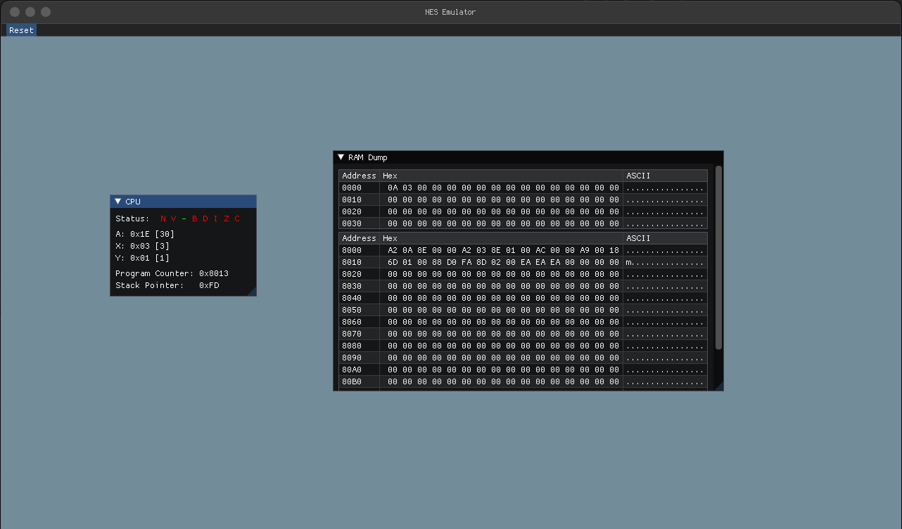

# NES Emulator

## About

This is an ongoing project where I attempt to emulate a Nintendo Entertainment System (NES). This idea is not new but I figured it would be really fun develop, slowly but surely.

## Screenshot



## Supported Platforms

This is actively being developed on Ubuntu 20.04 but can more than likely be built on other platforms.

## Prerequisites

In order to build, the following dependencies must be installed:

#### Debian/Ubuntu

```console
sudo apt install build-essential cmake ninja-build libglfw3 libglfw3-dev libglu1-mesa-dev freeglut3-dev mesa-common-dev
```

#### GCC 11


```console
sudo add-apt-repository ppa:ubuntu-toolchain-r/test
```

Next, download package information from all configured sources

```console
sudo apt update
```

Next, install gcc-11

```console
sudo apt install gcc-11 g++-11
```

Confirm the gcc version

```console
gcc-11 --version
```

## Build Intructions

To build this project, run the following command in the project directory:

```console
meta/build.sh
```

This will create the `./nes-emu` executable in the `build/` directory

Run with the following command:

```console
build/nes-emu
```

This project is still in development so there is a lot of functionality still missing.
