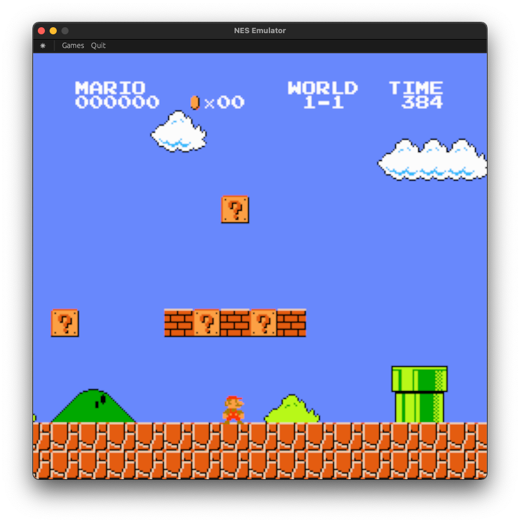

# NES Emulator

A NES emulator written in Rust. This is still a work in progress. It is mostly funcational but the audio and other mappers need to be implemented.



### Build & Run

```console
cargo run --release
```

NES ROM files should be put in the `roms` folder.
